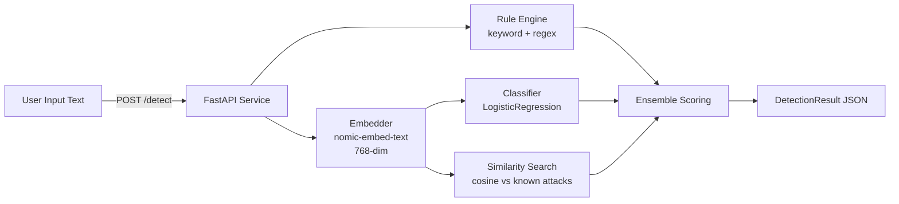
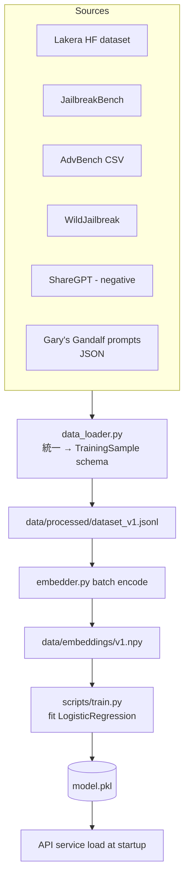
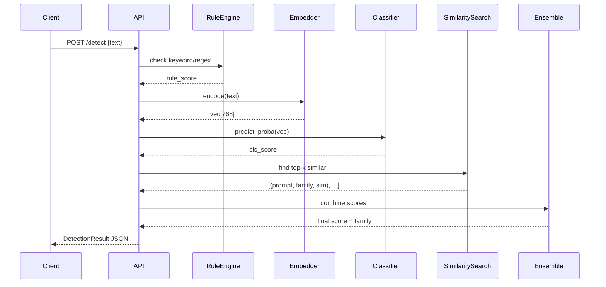

# System Flow

> 設計變更時更新本檔。

## 系統概觀

## 元件職責

| 元件 | 職責 | 對應檔案 |
|------|------|---------|
| API Layer | FastAPI HTTP 介面,routing 與 input validation | `src/api.py` |
| Rule Engine | 規則層偵測(keyword + regex 高頻 PI pattern) | `src/rule_engine.py` |
| Embedder | 文字 → 768 維向量(nomic-embed-text)+ cache | `src/embedder.py` |
| Classifier | 從 embedding 預測 injection 機率(LR / RF) | `src/classifier.py` |
| Similarity Search | 在已知攻擊 corpus 內找最相似樣本 | `src/detector.py` |
| Ensemble | 組合 rule + classifier + similarity 三源 score | `src/detector.py` |
| Schema | Pydantic 資料模型(統一 in/out 格式) | `src/schema.py` |

## 訓練資料流(離線)

## 推論流(線上)

## 後續迭代(v1.5+)

(待 v1 完成後填入)

- v1.5:RoBERTa fine-tuned classifier 並聯
- v2.0:Session-level tracking(同一使用者跨 query 累積評分)
- v2.5:多語言(中文)
- v3.0:對抗訓練(Garak / PyRIT 自動生成 adversarial sample 持續迭代)
