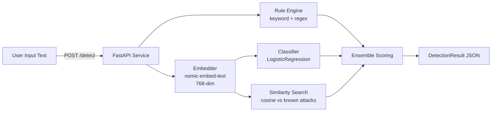
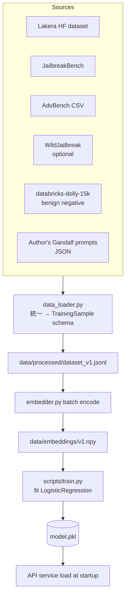
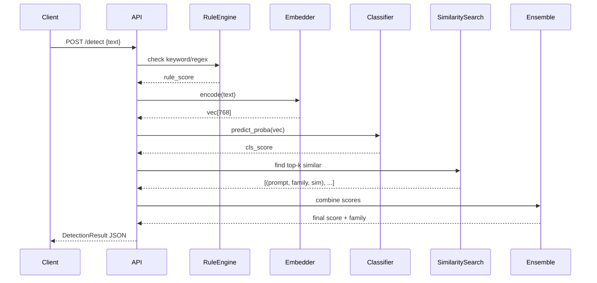
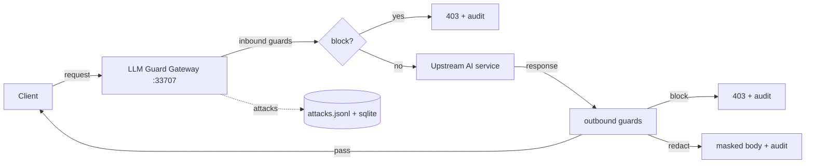

# System Flow

> 設計變更時更新本檔。

## 系統概觀

```mermaid
flowchart LR
    User[User Input Text] -->|POST /detect| API[FastAPI Service]
    API --> Rule[Rule Engine<br/>keyword + regex]
    API --> Embed[Embedder<br/>nomic-embed-text<br/>768-dim]
    Embed --> Cls[Classifier<br/>LogisticRegression]
    Embed --> Sim[Similarity Search<br/>cosine vs known attacks]
    Rule --> Ens[Ensemble Scoring]
    Cls --> Ens
    Sim --> Ens
    Ens --> Resp[DetectionResult JSON]
```

## 元件職責

| 元件 | 職責 | 對應檔案 |
|------|------|---------|
| API Layer | FastAPI HTTP 介面,routing 與 input validation | `src/api.py` |
| Rule Engine | 規則層偵測(keyword + regex 高頻 PI pattern) | `src/rule_engine.py` |
| Embedder | 文字 → 768 維向量(nomic-embed-text)+ cache | `src/embedder.py` |
| Classifier | 從 embedding 預測 injection 機率(LR / RF) | `src/classifier.py` |
| Similarity Search | 在已知攻擊 corpus 內找最相似樣本 | `src/detector.py` |
| Ensemble | 組合 rule + classifier + similarity 三源 score | `src/detector.py` |
| Schema | Pydantic 資料模型(統一 in/out 格式) | `src/schema.py` |

## 訓練資料流(離線)

```mermaid
flowchart TB
    subgraph Sources
        Lakera[Lakera HF dataset]
        JBB[JailbreakBench]
        AdvBench[AdvBench CSV]
        Wild[WildJailbreak<br/>optional]
        Dolly[databricks-dolly-15k<br/>benign negative]
        Gandalf[Author's Gandalf prompts<br/>JSON]
    end

    Sources --> Loader[data_loader.py<br/>統一 → TrainingSample schema]
    Loader --> JSONL[data/processed/dataset_v1.jsonl]
    JSONL --> EmbedBatch[embedder.py batch encode]
    EmbedBatch --> Cache[data/embeddings/v1.npy]
    Cache --> Train[scripts/train.py<br/>fit LogisticRegression]
    Train --> Model[(model.pkl)]
    Model --> Service[API service load at startup]
```

## 推論流(線上)

```mermaid
sequenceDiagram
    Client->>API: POST /detect {text}
    API->>RuleEngine: check keyword/regex
    RuleEngine-->>API: rule_score
    API->>Embedder: encode(text)
    Embedder-->>API: vec[768]
    API->>Classifier: predict_proba(vec)
    Classifier-->>API: cls_score
    API->>SimilaritySearch: find top-k similar
    SimilaritySearch-->>API: [(prompt, family, sim), ...]
    API->>Ensemble: combine scores
    Ensemble-->>API: final score + family
    API-->>Client: DetectionResult JSON
```

## v1.0 — LLM Guard Gateway(反向代理防禦層)

v0.1.0 的 `/detect` API 升級為一個獨立、離線的反向代理,擋在任意 AI 服務前。

```mermaid
flowchart LR
    C[Client] -->|request| GW[LLM Guard Gateway :33707]
    GW -->|inbound guards| IN{block?}
    IN -->|yes| R1[403 + audit]
    IN -->|no| UP[Upstream AI service]
    UP -->|response| OG[outbound guards]
    OG -->|block| R2[403 + audit]
    OG -->|redact| RD[masked body + audit]
    OG -->|pass| C
    GW -.->|attacks| LOG[(attacks.jsonl + sqlite)]
```

- **inbound guards**:llm01_injection、llm10_consumption、llm06_agency
- **outbound guards**:llm02_secret、llm07_sysprompt、llm05_output、(llm09_misinfo, off)
- **編排**:`pipeline.py` 逐 guard 隔離執行 → 依 severity 聚合 → 套用 mode(block/monitor/redact)
- **決策失敗隔離**:單一 guard 例外只跳過該 guard;fail_mode closed → 視為 BLOCK;連續錯誤 → circuit breaker
- **攻擊記錄**:`audit.py` 寫 JSONL + SQLite(供 Phase 2 AutoTest dashboard 讀)
- **覆蓋宣告**:見 [`../owasp_coverage.md`](../owasp_coverage.md);LLM03/04/08 為登記之 runtime gap

元件:`src/gateway.py`(代理)、`src/pipeline.py`(編排)、`src/audit.py`(記錄)、
`src/textio.py`(body 文字抽取)、`src/guards/*`(7 guards)、`src/config.py` + `config.yaml`。

## 後續迭代(v1.5+)

(待 v1 完成後填入)

- v1.5:RoBERTa fine-tuned classifier 並聯
- v2.0:Session-level tracking(同一使用者跨 query 累積評分)
- v2.5:多語言(中文)
- v3.0:對抗訓練(Garak / PyRIT 自動生成 adversarial sample 持續迭代)
